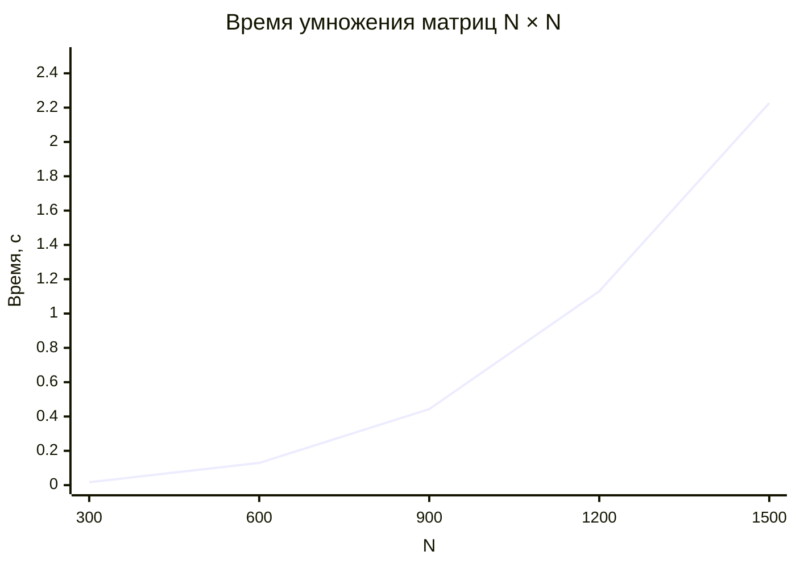

# Лабораторная работа №1: Последовательный алгоритм умножения матриц

## Цель работы

Получить данные о производительности последовательного алгоритма умножения квадратных матриц для последующего сравнения с параллельными реализациями.

## Задачи

* Написать программу для создания исходных матриц и записи их в файл
* Написать программу на языке C++ для перемножения двух квадратных матриц
* Написать скрипт для проверки вычислений на Python
* Сделать отчёт о проделанной работе

## Ход работы

### Создание исходных файлов

Генерация случайных матриц вынесена в отдельный модуль `RMatrix`. Функция принимает количество элементов и возвращает готовый вектор целых чисел в диапазоне от 0 до 100.

```cpp
export module RMatrix;

import std;

export std::vector<int> fillRandomValues(std::size_t totalElements, int low = 0, int high = 100) {
    if (low > high) throw std::invalid_argument("Invalid range");

    std::random_device rd;
    std::mt19937 generator(rd());
    std::uniform_int_distribution<int> distribution(low, high);

    std::vector<int> data(totalElements);
    for (auto& value : data) value = distribution(generator);
    return data;
}
```

Сохранение вектора в файл выполняет модуль `IOMatrix` — одно число на строку. Такой формат одинаково хорошо читается и в C++ через `operator>>`, и в NumPy через `np.loadtxt`.

```cpp
export void dumpVectorToFile(const std::vector<int>& data, const std::string& filepath) {
    if (data.empty()) return;

    std::ofstream out(filepath);
    if (!out) throw std::runtime_error("Cannot open file for writing: " + filepath);

    for (const auto& val : data) std::println(out, "{}", val);
}
```

### Основная программа на C++

Программа собрана из четырёх модулей:

| Модуль | Ответственность |
| --- | --- |
| `IOMatrix` | чтение, запись, вывод результата |
| `Multiplier` | само умножение матриц |
| `RMatrix` | генерация случайных матриц |
| `main` | точка входа, ввод размера, выбор ветки load/generate |

Загрузка матрицы из файла возвращает `bool` вместо исключения — решение о дальнейших действиях принимает `main`.

```cpp
export bool loadVectorFromFile(std::vector<int>& data, const std::string& filepath) {
    std::ifstream in(filepath);
    if (!in.is_open()) return false;

    int temp;
    while (in >> temp) data.push_back(temp);
    return true;
}
```

Поскольку `std::vector` одномерен, а матрица хранится построчно, используется формула умножения в одномерном представлении. Внешние два цикла идут по `i` и `k`, во внутреннем считается сразу вся строка результата. Такой порядок циклов обеспечивает последовательный доступ к памяти и хорошую кэш-локальность.

```cpp
export void multiplyMatricesSequential(const std::vector<int>& matA,
                                       const std::vector<int>& matB,
                                       std::vector<long long>& matC,
                                       std::size_t n) {
    matC.assign(n * n, 0);

    for (std::size_t row = 0; row < n; ++row) {
        for (std::size_t inner = 0; inner < n; ++inner) {
            long long a_element = matA[row * n + inner];
            for (std::size_t col = 0; col < n; ++col) {
                matC[row * n + col] += a_element * matB[inner * n + col];
            }
        }
    }
}
```

Запись результата сопровождается шапкой с метаданными. Символ `#` в начале строки — маркер комментария: NumPy пропускает такие строки автоматически через `comments='#'`, поэтому файл остаётся и читаемым глазами, и парсится без хаков.

```cpp
export void saveComputationResult(const std::vector<long long>& matrix,
                                  const std::string& filename,
                                  std::size_t dimension,
                                  double elapsedSeconds) {
    std::ofstream out(filename);
    if (!out) throw std::runtime_error("Cannot open result file: " + filename);

    std::println(out, "# --- Computation Report ---");
    std::println(out, "# Time elapsed: {:.6f} sec", elapsedSeconds);
    std::println(out, "# Matrix dimension: {}x{}", dimension, dimension);
    std::println(out, "# Total elements: {}", dimension * dimension);
    std::println(out, "# --------------------------");

    for (std::size_t i = 0; i < dimension; ++i) {
        for (std::size_t j = 0; j < dimension; ++j)
            std::print(out, "{:10}", matrix[i * dimension + j]);
        std::println(out, "");
    }
    std::println("Result successfully saved to {}", filename);
}
```

Точка входа. Сначала спрашиваем размер, потом пытаемся загрузить обе матрицы. Если хотя бы одна не открылась — генерируем обе заново и сохраняем, чтобы при следующем запуске они уже читались с диска. Время замеряется через `std::chrono::steady_clock`.

```cpp
int main() {
    constexpr std::array validSizes = {300, 600, 900, 1200, 1500};
    std::println("=== Matrix Multiplication Lab (Sequential) ===");
    std::println("Available sizes: 300, 600, 900, 1200, 1500");

    int n = 0;
    while (true) {
        std::cin >> n;
        if (std::ranges::contains(validSizes, n)) break;
        std::println("Invalid size. Try again");
    }

    auto getDataPath = [](int size, int index) {
        return std::format("../../data/matrix_{}_{}.txt", size, index);
    };

    std::vector<int> matrixA, matrixB;
    std::vector<long long> matrixC;

    bool isLoaded = loadVectorFromFile(matrixA, getDataPath(n, 1))
                 && loadVectorFromFile(matrixB, getDataPath(n, 2));

    if (!isLoaded) {
        std::println("[INFO] Data files not found. Generating...");
        matrixA = fillRandomValues(n * n);
        matrixB = fillRandomValues(n * n);
        dumpVectorToFile(matrixA, getDataPath(n, 1));
        dumpVectorToFile(matrixB, getDataPath(n, 2));
    }

    auto startTime = std::chrono::steady_clock::now();
    multiplyMatricesSequential(matrixA, matrixB, matrixC, n);
    auto endTime = std::chrono::steady_clock::now();

    std::chrono::duration<double> elapsed = endTime - startTime;
    std::println("[DONE] Computation finished in {:.4f} seconds.", elapsed.count());

    saveComputationResult(matrixC, std::format("../../data/result_{}.txt", n), n, elapsed.count());
}
```

### Проверка результата на Python

Для подтверждения правильности работы алгоритма использована автоматизированная верификация на Python с библиотекой NumPy. Скрипт читает обе исходные матрицы и результат, считает эталонное произведение `A @ B` и сравнивает с тем, что записала C++ программа.

Пути строятся от расположения самого скрипта через `Path(__file__)`, поэтому его можно запускать из любой директории.

```python
from pathlib import Path
import numpy as np

base = Path(__file__).resolve().parent.parent / "data"

sizes = [300, 600, 900, 1200, 1500]

for n in sizes:
    try:
        a = np.loadtxt(base / f"matrix_{n}_1.txt", dtype=np.int64).reshape(n, n)
        b = np.loadtxt(base / f"matrix_{n}_2.txt", dtype=np.int64).reshape(n, n)
        c = np.loadtxt(base / f"result_{n}.txt", dtype=np.int64, comments='#')

        print(f"[{n}x{n}] {'OK' if np.array_equal(a @ b, c) else 'FAIL'}")
    except FileNotFoundError as e:
        print(f"[{n}x{n}] skip ({e.filename})")
```

Результаты верификации:

```
[300x300]   OK
[600x600]   OK
[900x900]   OK
[1200x1200] OK
[1500x1500] OK
```

Все пять размеров прошли проверку — результаты полностью совпадают с эталоном.

### Результаты измерений производительности

Эксперимент проводился на последовательной реализации алгоритма умножения матриц. Для каждого размера матрицы `N × N` было проведено 3 замера времени выполнения. Результаты представлены в таблице 1.

| Размер матрицы | Измерение #1 | Измерение #2 | Измерение #3 | **Среднее** |
| --- | --- | --- | --- | --- |
| **300 × 300**   | 0,0163 | 0,0161 | 0,0177 | **0,0167 с** |
| **600 × 600**   | 0,1347 | 0,1280 | 0,1248 | **0,1292 с** |
| **900 × 900**   | 0,4268 | 0,4381 | 0,4645 | **0,4431 с** |
| **1200 × 1200** | 1,1069 | 1,1539 | 1,1286 | **1,1298 с** |
| **1500 × 1500** | 2,2245 | 2,2768 | 2,1787 | **2,2267 с** |

Таблица 1. Время выполнения умножения матриц (в секундах)


Рис. 1. Экспериментальная зависимость времени выполнения от размера матрицы

**Анализ результатов.** Как видно из таблицы и графика, зависимость времени выполнения от размера матрицы носит ярко выраженный нелинейный характер.

- При увеличении размера матрицы в 2 раза (например, с 300 до 600) время выполнения возрастает примерно в 8 раз: `0,0167 → 0,1292` = **×7,7**.
- При увеличении размера матрицы в 2 раза (с 600 до 1200) время выполнения также возрастает примерно в 8 раз: `0,1292 → 1,1298` = **×8,7**.
- При увеличении размера в 5 раз (с 300 до 1500) время возрастает примерно в 133 раза, что соответствует `5³ = 125`.

Это полностью подтверждает теоретическую оценку трудоёмкости алгоритма `O(N³)`.

## Вывод

В ходе лабораторной работы был реализован и исследован последовательный алгоритм умножения квадратных матриц.

1. **Подтверждена сложность `O(N³)`.** Экспериментальные данные показывают, что при увеличении линейного размера матрицы `N` в `k` раз время выполнения увеличивается примерно в `k³` раз.
2. **Получена точка отсчёта.** Для матрицы 1500 × 1500 последовательному алгоритму требуется около 2,23 секунды. Это значение будет использоваться для оценки эффективности параллельных реализаций в следующих работах.
3. **Корректность доказана.** Автоматизированная верификация через NumPy подтвердила полное совпадение результатов для всех пяти размеров матриц.